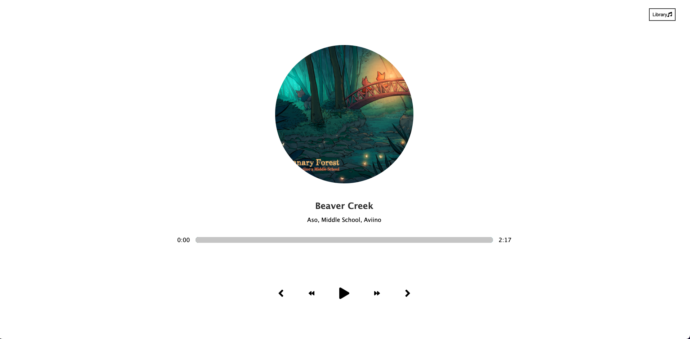
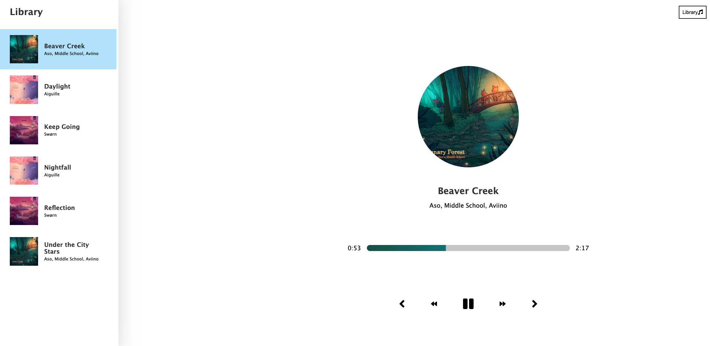

# Music player based on React and Sass

**THIS IS A NON-COMMERCIAL-PROJECT CREATED WITH REACT**

A musicplayer application with normal player functionality.

Current version: 1.0 || 23.03.2021

## Screenshots

## 🖱 Deployment

Update 11/25/2022: Thanks to Salesforce wanting to make money on Heroku even with private projects and therefore eliminating Free Dynos as of 11/28/2022, this app is **TEMPORARILY OFFLINE**.

## 📲 Design and layout infos

Designed for desktop, but is also halfway mobile friendly

## 🔧 Development

### Requirements

Node.js and npm

### 👨‍💻 Install all dependencies

`npm install`

Since there is a postinstall, the system automatically searches the client folder and installs the required dependencies there, too.

### 📜 .env

No enviroments needed
